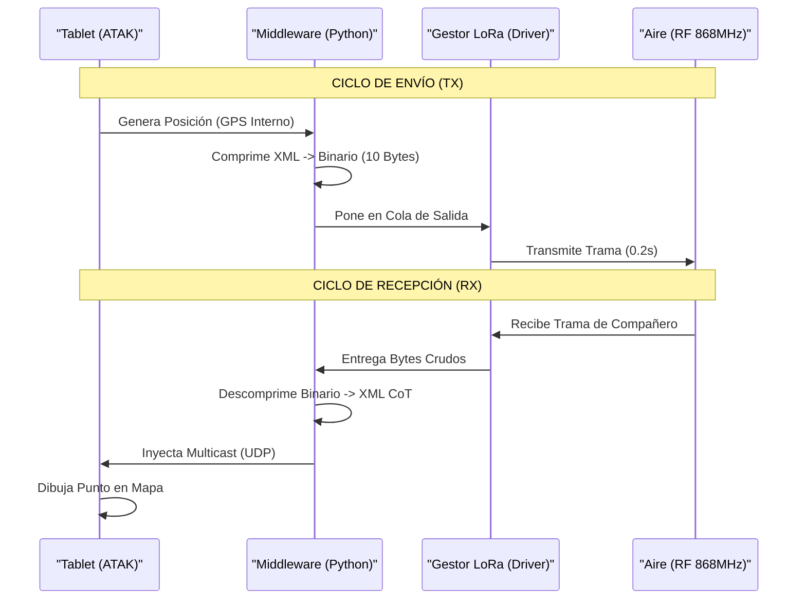

# Tactical Field Grid (T.F.G)
##📡 Proyecto TFG: Red Táctica Híbrida de Malla (Hybrid Tactical Mesh Network)

**Estado del Proyecto:** Fase de Desarrollo de Software (Prototipado de Protocolos).
**Objetivo:** Desarrollar un "Nodo Táctico Personal" para entornos sin infraestructura (MANET). El sistema fusiona vídeo de alta velocidad (WiFi) y telemetría de largo alcance (LoRa) en una arquitectura horizontal donde cada soldado es un nodo repetidor independiente.

---

## 1. Concepto y Arquitectura 🧠

El sistema abandona el modelo jerárquico tradicional (Base ↔ Soldado) por una arquitectura **Peer-to-Peer (P2P)**. Cada operador lleva un "Nodo Táctico" autónomo que gestiona sus propias comunicaciones.

**Filosofía de "Doble Plano":**

1.  **Plano de Banda Ancha (Vídeo - Corto Alcance):**
    * **Tecnología:** WiFi 2.4 GHz (802.11s + B.A.T.M.A.N. adv).
    * **Función:** Transmisión de vídeo en tiempo real y descarga de mapas.
    * **Comportamiento:** Oportunista. Si los nodos están cerca, se enlazan para pasar vídeo.
2.  **Plano de Supervivencia (C2 - Largo Alcance):**
    * **Tecnología:** LoRa 868 MHz (Protocolo Binario Propietario).
    * **Función:** Posicionamiento (PLI), Chat Táctico y Marcadores de Peligro.
    * **Comportamiento:** Persistente. Garantiza que los puntos en el mapa ATAK se muevan incluso si el soldado está a kilómetros de distancia y sin línea de vista (BLOS).

**Topología:**

* **Lógica:** Malla (Mesh) distribuida. Todos los nodos pueden enrutar tráfico de otros.
* **Física:** Enlace inalámbrico Ad-Hoc/Mesh Point entre nodos móviles.

---

## 2. Hardware y Presupuesto Estimado 🛠️

La selección de hardware prioriza componentes COTS (*Commercial Off-The-Shelf*) compatibles nativamente con Linux y estándares abiertos.

### Nodo Base / Soldado (Por unidad)

| Componente | Modelo Recomendado | Justificación Técnica | Precio Est. |
| --- | --- | --- | --- |
| **Computador** | Raspberry Pi 4/5 (o PC Portátil) | Potencia suficiente para codificar vídeo y gestionar enrutamiento. | 60€ - N/A |
| **Interfaz WiFi** | **Alfa Network AWUS036ACM** | Chipset **MT7612U**. Soporta modo Monitor, Inyección y **Mesh Point (802.11s)**. Doble puerto de antena (MIMO/Diversidad). | ~35€ |
| **Interfaz LoRa** | Módulo ESP32 LoRa (LilyGO/TTGO) | Para correr el firmware de interfaz RNS (Reticulum). Económico y bajo consumo. | ~15€ |
| **Antenas** | 2x Omnidireccionales + (Opcional) 1x Panel | 2.4GHz para WiFi y 868MHz para LoRa. Uso de antena de panel en Base para sectorización. | ~20€ |
| **Total aprox.** |  |  | **~130€ / nodo** |

---

## 3. Stack de Software y Lógica 💻

El núcleo del proyecto es un **Middleware en Python** (`tactical_node.py`) que actúa como traductor entre el mundo físico (Radio) y el usuario (ATAK).

### A. Capa de Red (Vídeo - WiFi)

* **Estándar:** IEEE **802.11s** (Mesh Point). Sustituye al antiguo modo Ad-Hoc (IBSS) por ser más eficiente y soportar seguridad moderna.
* **Protocolo de Enrutamiento:** **B.A.T.M.A.N. adv** (Better Approach To Mobile Ad-hoc Networking).
* *Lógica:* Opera en Capa 2 (Enlace de Datos). Simula un switch virtual gigante donde todos los nodos parecen estar conectados por un cable ethernet invisible.

* **Frecuencia:** **2.4 GHz** (Canales 1, 6 u 11).
* *Motivo:* Mejor penetración de obstáculos (árboles, muros) que 5GHz, crucial para operarios a nivel de suelo.

### B. Capa de Control (Comandos - LoRa)

* **Protocolo:** **Reticulum Network Stack (RNS)**.
* *Lógica:* Red soberana sin IP. Usa criptografía asimétrica para direccionamiento. Si el WiFi cae, RNS sigue enviando coordenadas y estado del soldado.

* **Frecuencia:** **868 MHz** (Europa). Alcance de varios Km con baja tasa de datos.

### C. Capa de Aplicación (ATAK Integration)
El sistema utiliza **ATAK (Android Team Awareness Kit)** como interfaz única.
* **Conexión:** El middleware inyecta datos en ATAK mediante paquetes UDP Multicast (`239.2.3.1:6969`).
* **Transparencia:** El soldado no interactúa con la Raspberry Pi; solo usa el mapa en su tablet.

### D. Capa de Transporte Híbrido (El "Cerebro")
Un script Python multihilo gestiona el tráfico inteligentemente:

1.  **Gestor de Vídeo (GStreamer):**
    * Captura vídeo por hardware (H.264) y lo envía vía RTP sobre la red B.A.T.M.A.N. (WiFi).
2.  **Gestor de Datos (LoRa Resource Guard):**
    * Implementa un patrón **Productor-Consumidor** con Colas (`Queue`) para gestionar el acceso exclusivo al chip LoRa (Half-Duplex).
    * Evita colisiones entre mensajes salientes (GPS) y entrantes (Chat).

### E. Protocolo de Reducción de Datos (Binary Packing)
Para viabilizar el uso de LoRa (ancho de banda < 1kbps), se ha diseñado un protocolo binario que sustituye al XML estándar de CoT.

* **Problema:** Un mensaje XML de posición ocupa ~600 bytes (3 segundos de aire en LoRa).
* **Solución:** Compresión con `struct` a formato binario.
    * **Estructura:** `[CABECERA 1B] + [ID 1B] + [LAT 4B] + [LON 4B]`.
    * **Resultado:** **10 Bytes por mensaje**.
    * **Eficiencia:** Permite actualizar la posición de todo un pelotón en menos de 1 segundo.

---

## 4. Desafíos de Ingeniería y Soluciones Adoptadas 🚧

Durante la fase de diseño, se encontraron los siguientes problemas técnicos y se definieron estas soluciones:

### 🔴 Problema 1: Beamforming y Sigilo (LPD)

**El reto:** Las tarjetas WiFi comerciales USB no permiten *Beamforming* activo (Phased Array) por software para dirigir la señal y evitar ser detectados por el enemigo.
**La Solución:** Estrategia mixta Software/Hardware.

1. **ATPC (Software):** Implementar un script que lea la calidad del enlace (TQ/RSSI) y ajuste dinámicamente la potencia de transmisión (`txpower`). *Lógica: "Susurrar" en vez de gritar si el receptor está cerca.*
2. **Diversidad de Sector (Hardware):** Usar los dos puertos de antena de la tarjeta Alfa ACM. Conectar una antena orientada al Norte y otra al Sur. El driver elegirá la mejor antena (Diversity), simulando un direccionamiento básico.

### 🔴 Problema 2: Vídeo Analógico vs. Digital

**El reto:** El vídeo analógico (5.8GHz FPV) tiene latencia cero, pero no permite enrutamiento.
**La Solución:** Uso de **Vídeo Digital**.

* Aunque tiene más latencia (~100-200ms), permite encapsular el vídeo en paquetes IP. Esto habilita la **topología Mesh** (saltar de un soldado a otro para llegar a la base) y el **cifrado** de la imagen, requisitos indispensables para una red táctica.

### 🔴 Problema 3: Conexión Automática Segura

**El reto:** Necesidad de que los soldados se conecten automáticamente al encender el equipo (Zero-Touch) sin dejar la red abierta a intrusos.
**La Solución:** **WPA3-SAE**.

* Utilizar el estándar 802.11s con autenticación SAE (Simultaneous Authentication of Equals) pre-configurada en el archivo `wpa_supplicant`.
* Esto permite autodescubrimiento seguro: los nodos solo hacen "peering" si tienen la clave criptográfica correcta.

### 🔴 Problema 4: WiFi HaLow (802.11ah) vs. Híbrido

**El reto:** Existencia de tecnologías unificadas (HaLow) que prometen largo alcance y vídeo en un solo chip.
**La Solución:** Mantener la **Arquitectura Híbrida**.

* Se rechaza HaLow por falta de madurez en drivers Linux y por seguridad operativa: Si se satura o interfiere la frecuencia única de HaLow, se pierde *todo*. Con el sistema híbrido (2.4G + 868M), se garantiza la supervivencia del enlace de control (LoRa) ante la pérdida del vídeo.
* 

### 🔴 Problema 5: Estrategia de Autoconfiguración "Zero-Touch" 🤖
**El reto:** Necesidad de una configuración "Zero-Touch" para generar una red Ad-Hoc
**La Solución:** Para garantizar la operatividad inmediata en campo sin intervención técnica (sin teclados ni pantallas), se ha diseñado un sistema de auto-descubrimiento y configuración automática que elimina la necesidad de servidores DHCP centrales.

**A. Direccionamiento IP Algorítmico (Persistencia de Identidad)**
En lugar de depender de un servidor DHCP (punto único de fallo), cada nodo calcula su propia dirección IPv4 basándose en su dirección física (MAC Address). Esto garantiza que un soldado siempre tenga la misma IP en cualquier misión, facilitando la identificación.

Lógica: Conversión de los dos últimos octetos de la MAC de Hexadecimal a Decimal.

Espacio de direcciones: Subred privada 10.0.0.0/16.

Fórmula:

Dado MAC: XX:XX:XX:XX:YY:ZZ

IP Generada: 10.0.DEC(YY).DEC(ZZ)

Ejemplo: MAC ...:25:1A → IP 10.0.37.26.

**B. Gestión de Claves por Hardware (Mission Key)**
Para cambiar de red o rotar claves de cifrado sin reconfigurar el sistema operativo, se implementa un mecanismo de "Llave de Misión".

Funcionamiento: Al inicio, el sistema busca un archivo de configuración (wpa_supplicant.conf) en medios extraíbles (USB). Si lo encuentra, actualiza la configuración WiFi automáticamente.

Ventaja Operativa: Permite reasignar un dron o soldado a un pelotón diferente simplemente cambiando la tarjeta SD o conectando un USB de configuración antes del encendido.

### 🔴 Problema 6: El "Cuello de Botella" de LoRa
**El reto:** Enviar XML crudo por LoRa satura el espectro y agota la batería.
**La Solución:** **Deshidratación/Rehidratación de CoT**.
El nodo emisor "deshidrata" el XML a binario (10 bytes). El nodo receptor "rehidrata" esos bytes convirtiéndolos de nuevo a XML válido para que su ATAK local lo entienda.

### 🔴 Problema 7: Concurrencia en Hardware (Race Conditions)
**El reto:** El hilo que lee el GPS y el hilo que escucha la radio intentan acceder al puerto serie LoRa simultáneamente.
**La Solución:** **Thread-Safe Queue Manager**.
Se implementa un "Hilo Controlador" dedicado (Traffic Cop) que es el único con permiso de escritura en el hardware. El resto de procesos solo depositan solicitudes en una cola segura.

---

## 5. Arquitectura del Software (Diagrama de Flujo)

## 6. Próximos Pasos (Roadmap) 🚀
Fase 1 (Actual): Simulador de Protocolo.

- Crear entorno virtual en Python (tactical_node.py).

- Simular tráfico GPS y validar la compresión binaria.

- Probar la inyección de XML en ATAK (Android/Windows) vía WiFi local.

Fase 2: Integración Hardware.

- Conectar módulos LoRa reales.

- Validar alcance y tiempos de latencia.

Fase 3: Malla de Vídeo.

- Configurar batman-adv y optimizar el bitrate de GStreamer.

Actualizado 181020FEB26
